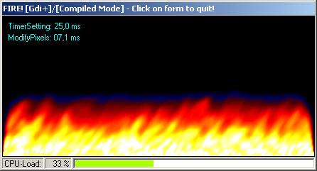



## FIRE GDI\+

### Description

FIRE GDIplus - a must-see for all who like Cecri's fire effect!

Based on his code, I used GDIplus to display it ***MUCH*** faster at double width. This is done by using GdipBitmapLockBits to enable direct memory access. No more CPU-hog! But be sure to COMPILE IT to see how fast it works!!

Includes API-Timer, display of CPU-load with ProgressBar within StatusBar.

This is my first post. I've put a lot of work on this. Please download and tellme what you think - comments, sugestions and of course, votes are welcome.
 
### More Info
 
GDIplus.dll needed

             |
---                |---
**Submitted On**   |2004-09-04 23:40:00
**By**             |[joerg](https://github.com/Planet-Source-Code/PSCIndex/blob/master/ByAuthor/joerg.md)
**Level**          |Intermediate
**User Rating**    |4.6 (23 globes from 5 users)
**Compatibility**  |VB 5\.0, VB 6\.0
**Category**       |[Graphics](https://github.com/Planet-Source-Code/PSCIndex/blob/master/ByCategory/graphics__1-46.md)
**World**          |[Visual Basic](https://github.com/Planet-Source-Code/PSCIndex/blob/master/ByWorld/visual-basic.md)
**Archive File**   |[FIRE\_GDI\+179010952004\.zip](https://github.com/Planet-Source-Code/joerg-fire-gdi__1-56033/archive/master.zip)

